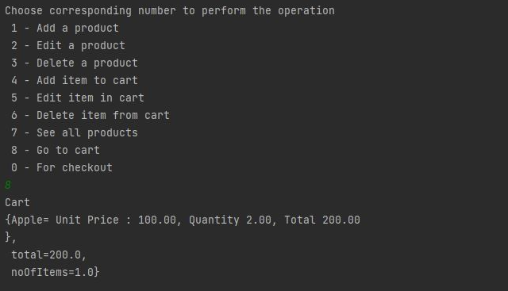

#MyEcom2

I have made an E-Com application for the grocery item.

During this project I have learned many important  and new concepts like:
 **.** OOPs Concepts
**.** UML basics
 **.** How to design classes and object in well structured form.

For this project important commits are:
1. use a [reference link][1].
[1]:My Ecom
2. My Ecom1
3. My Ecom2

**Here are some ss to explain how it works:**

  
  
  
  
  
  
  